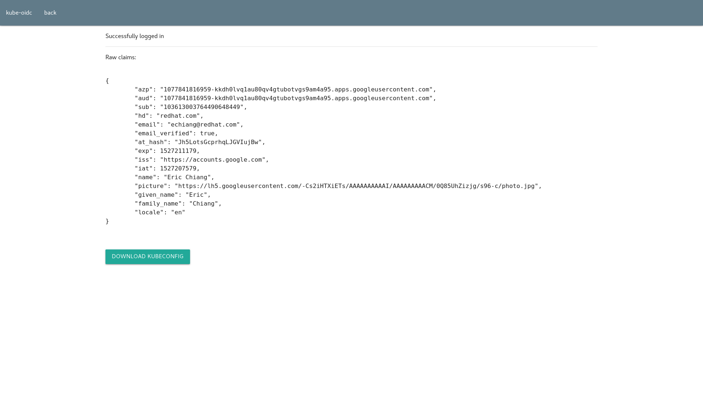

# OpenID Connect utilities for Kubernetes

[](https://travis-ci.org/ericchiang/kube-oidc)

## OpenID Connect and Kubernetes

[OpenID Connect][oidc-docs] is an extension of OAuth2 that introduces ID Tokens, a signed JSON Web Token with standard claims representing users.

For example, OpenID Connect might return the following JWT:

```
eyJhbGciOiJSUzI1NiIsImtpZCI6IjAyOWYyNjlmM2YwNmFmMWU5M2RhYzY3MDYzOTc3ZjcxM2E3N2YxOWUifQ.eyJhenAiOiIxMDc3ODQxODE2OTU5LWtrZGgwbHZxMWF1ODBxdjRndHVib3R2Z3M5YW00YTk1LmFwcHMuZ29vZ2xldXNlcmNvbnRlbnQuY29tIiwiYXVkIjoiMTA3Nzg0MTgxNjk1OS1ra2RoMGx2cTFhdTgwcXY0Z3R1Ym90dmdzOWFtNGE5NS5hcHBzLmdvb2dsZXVzZXJjb250ZW50LmNvbSIsInN1YiI6IjEwMzYxMzAwMzc2NDQ5MDY0ODQ0OSIsImhkIjoicmVkaGF0LmNvbSIsImVtYWlsIjoiZWNoaWFuZ0ByZWRoYXQuY29tIiwiZW1haWxfdmVyaWZpZWQiOnRydWUsImF0X2hhc2giOiJPR0RPaklKOTJGa2F0REJvQ204eWRnIiwiZXhwIjoxNTI3MjAzOTQwLCJpc3MiOiJodHRwczovL2FjY291bnRzLmdvb2dsZS5jb20iLCJpYXQiOjE1MjcyMDAzNDAsIm5hbWUiOiJFcmljIENoaWFuZyIsInBpY3R1cmUiOiJodHRwczovL2xoNS5nb29nbGV1c2VyY29udGVudC5jb20vLUNzMmlIVFhpRVRzL0FBQUFBQUFBQUFJL0FBQUFBQUFBQUNNLzBRODVVaFppempnL3M5Ni1jL3Bob3RvLmpwZyIsImdpdmVuX25hbWUiOiJFcmljIiwiZmFtaWx5X25hbWUiOiJDaGlhbmciLCJsb2NhbGUiOiJlbiJ9.RjnTPN6RoQqL-lufUoAZxfaNVzET1uBZpszEodRZJlutYdThZHq_97bitG_qy5mIy07BmBPvr6lqOAeqBadENSkudhj6pQR9C3YD5Uyj9yTh7xp4CUx01Az6gsi8OCOgE1RCDRVwAialRhBlf3GCz4QBtBcwogTNVBoiDEwa5SKfopnwxsuKo_mBoHOjo9i_h-SakybrTe5ZJY_FuthtDli-s5LpFCuaiTLv6UpR84Zw9sNaxQ7Riiw1Mxya0xQXZnewhoJ8N2TwYlXuJJORvF0Pe2qjDwQmMEiqrv53E-f6C5pekGZip-ZtpDvZ7WmlNd5yGIbB8xvcH0RuHQLOoA
```

This ID Token holds claims such as the user's emal, username, and an expiration:

```json
{
    "azp": "1077841816959-kkdh0lvq1au80qv4gtubotvgs9am4a95.apps.googleusercontent.com",
    "aud": "1077841816959-kkdh0lvq1au80qv4gtubotvgs9am4a95.apps.googleusercontent.com",
    "sub": "103613003764490648449",
    "hd": "redhat.com",
    "email": "echiang@redhat.com",
    "email_verified": true,
    "at_hash": "OGDOjIJ92FkatDBoCm8ydg",
    "exp": 1527203940,
    "iss": "https://accounts.google.com",
    "iat": 1527200340,
    "name": "Eric Chiang",
    "picture": "https://lh5.googleusercontent.com/-Cs2iHTXiETs/AAAAAAAAAAI/AAAAAAAAACM/0Q85UhZizjg/s96-c/photo.jpg",
    "given_name": "Eric",
    "family_name": "Chiang",
    "locale": "en"
}
```

Many providers have support for OpenID Connect, including:

* [Google][google-oidc]
* [Azure][azure-oidc]
* [Okta][okta-oidc]
* [Salesforce][salesforce-oidc]
* [Dex][dex]

Kubernetes can validated [ID Tokens][kubernetes-oidc], but leaves login flows and other conviences as exercises to the user. This repo is intended to hold tools that fill in gaps and improve the experience of setting up SSO for Kubernetes clusters.

[azure-oidc]: https://msdn.microsoft.com/en-us/library/azure/dn645541.aspx
[dex]: https://github.com/coreos/dex
[google-oidc]: https://developers.google.com/identity/protocols/OpenIDConnect
[kubernetes-oidc]: https://kubernetes.io/docs/reference/access-authn-authz/authentication/#openid-connect-tokens
[oidc-docs]: http://openid.net/connect/
[okta-oidc]: https://developer.okta.com/docs/api/resources/oidc
[salesforce]: https://developer.salesforce.com/page/Inside_OpenID_Connect_on_Force.com

## kube-oidc-login

`kube-oidc-login` is an OAuth2 client for generating user kubeconfig files. Its logs in the user through an OpenID conenct provider, then templates the returned ID Token into the kubeconfig:



## kube-oidc-proxy

`kube-oidc-proxy` is an authenticating proxy for the Kubernetes API server. It authenticates OpenID Connect ID Tokens then [impersonates the authenticaed user][impersionation] to the API server.

Unlike other OpenID Connect solutions, `kube-oidc-prox` doesn't require reconfiguration of the API server and works with any Kubernetes cluster out of the box.

[impersionation]: https://kubernetes.io/docs/reference/access-authn-authz/authentication/#user-impersonation

## Getting started

This guide requires:

* A Kubernetes cluster (consider [Minikube][minikube] to run one locally)
* An OAuth2 Google client credentials and a Google account
* Go 1.10+

Clone this repo to your local [GOPATH][gopath].

```
git clone https://github.com/ericchiang/kube-oidc.git $( go env GOPATH )/src/github.com/ericchiang/kube-oidc
cd $( go env GOPATH )/src/github.com/ericchiang/kube-oidc
```

Register a "Web application" [OAuth client with Google][google-oauth2] and enter `http://localhost:8080/login/callback` as an authorized redirect URI. Set the OAuth client ID and secret as environment variables, as well as your email:

```
export GOOGLE_OAUTH2_CLIENT_ID="..."
export GOOGLE_OAUTH2_CLIENT_SECRET="..."
export USER_EMAIL="jane.doe@gmail.com"
```

The `examples` directory holds reference config files for `kube-oidc-login` and `kube-oidc-proxy`. Use `sed` to template these with the values defined above and generate self-signed certs for the proxy:

```
mkdir -p assets
mkdir -p secrets
sed "s/CLIENT_ID/$GOOGLE_OAUTH2_CLIENT_ID/g" examples/config-login.yaml > assets/config-login.yaml
sed "s/CLIENT_ID/$GOOGLE_OAUTH2_CLIENT_ID/g" examples/config-proxy.yaml > assets/config-proxy.yaml
echo -n "$GOOGLE_OAUTH2_CLIENT_SECRET" > secrets/client-secret
kubectl config view --raw=true > secrets/kubeconfig
make example-certs
sed "s/USER_EMAIL/$USER_EMAIL/g" examples/rbac.yaml > assets/rbac.yaml
kubectl apply -f assets/rbac.yaml
```

These commands should create the following directory structure:

```
$ tree assets/ secrets/
assets/
├── ca.csr
├── ca-key.pem
├── ca.pem
├── config-login.yaml
├── config-proxy.yaml
├── rbac.yaml
├── server.csr
├── server-key.pem
└── server.pem
secrets/
├── client-secret
└── kubeconfig

0 directories, 11 files
```

First, run `kube-oidc-login`:

```
make
./bin/kube-oidc-login serve assets/config-login.yaml
```

In another window run `kube-oidc-proxy`:

```
./bin/kube-oidc-proxy serve assets/config-proxy.yaml
```

Visit [http://localhost:8080/](http://localhost:8080) to login with Google. The `email` claim MUST match the `USER_EMAIL` environment variable defined above. If the values don't match, re-template and re-apply the RBAC manifest.

Use the downloaded kubeconfig to access the cluster through the OpenID Connect proxy:

```
$ kubectl --kubeconfig ~/Downloads/kubeconfig get pods -n kube-system
NAME                                                              READY     STATUS    RESTARTS   AGE
heapster-6f69d6797f-jvlg8                                         2/2       Running   3          5d
kube-apiserver-f94t9                                              1/1       Running   1          5d
kube-controller-manager-6d6db4c69d-jmhtj                          1/1       Running   2          5d
kube-dns-64cd9cc494-bqwvx                                         3/3       Running   3          5d
kube-flannel-jzqjz                                                2/2       Running   4          5d
kube-flannel-xvblb                                                2/2       Running   2          5d
kube-proxy-kgqth                                                  1/1       Running   1          5d
kube-proxy-rzqsk                                                  1/1       Running   1          5d
kube-scheduler-7b675dc9f7-jppj6                                   1/1       Running   1          5d
pod-checkpointer-h298b                                            1/1       Running   1          5d
pod-checkpointer-h298b-ip-10-0-22-42.us-west-1.compute.internal   1/1       Running   1          5d
$ kubectl --kubeconfig ~/Downloads/kubeconfig get nodes
Error from server (Forbidden): nodes is forbidden: User "echiang@redhat.com" cannot list nodes at the cluster scope
```

[google-oauth2]: https://developers.google.com/identity/protocols/OpenIDConnect#appsetup
[gopath]: https://github.com/golang/go/wiki/GOPATH
[minikube]: https://github.com/kubernetes/minikube
